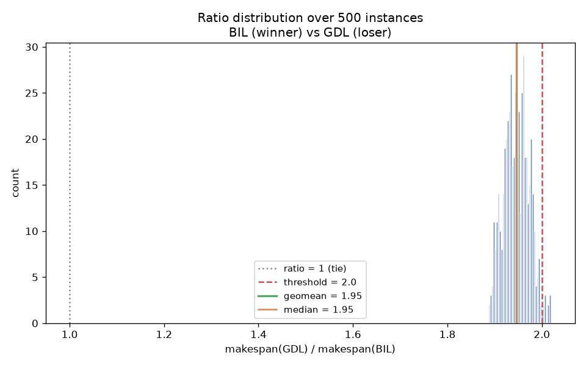
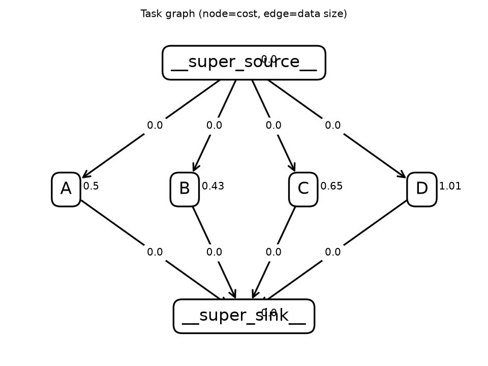
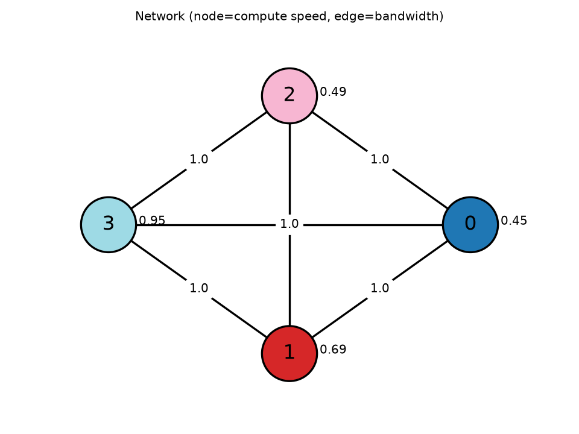
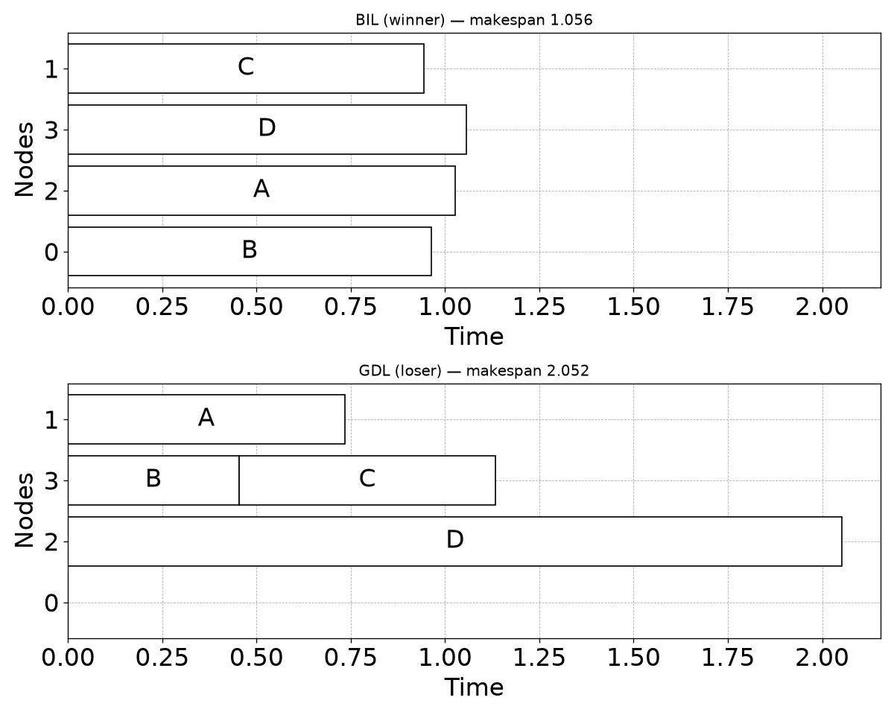

# Family report: BIL (winner) vs GDL (loser)

Family source: `/tmp/claude-1000/-home-quinn-Documents-code-agentic-hypothesis/bf4a5d30-311d-477b-82d6-5ccbbc48c4f9/scratchpad/family_BIL_vs_GDL_cost.py`

## Hypothesis

With saga's GDL min/max bug fixed, BIL and GDL are close peers, but a real, moderate (~1.9-1.96x), highly CONSISTENT gap remains on a pure task-to-node assignment instance (independent tasks, heterogeneous nodes, zero dependencies): BIL's per-task priority is a fully recursive bottom-up estimate through the whole descendant subtree, while GDL's default dynamic_level_2 only looks one hop ahead (the single largest-output child). For this zero-dependency seed there is no chain to look ahead through at all, so the gap instead comes from how each scheduler's own tournament/tie-break assigns several simultaneously-ready tasks to nodes of different speeds -- BIL's assignment is simply better calibrated than GDL's for this batch, and unusually consistently so (p10 stays close to the geomean, unlike a typical narrow numeric coincidence where p10 lags far behind).

## Makespan ratio  loser / winner

| metric | value |
|---|---|
| samples usable | 500 / 500 (0 errors) |
| geomean | 1.946 |
| mean | 1.947 |
| median | 1.946 |
| stdev | 0.027 |
| p10 / p90 | 1.910 / 1.980 |
| min / max | 1.887 / 2.019 |
| frac ≥ 2.0 | 2.2% |
| mean makespan winner / loser | 1.051 / 2.045 |
| **verdict** | **MODERATE/CONSISTENT** |

## Exemplar instance

Representative instance: winner makespan 1.056, loser makespan 2.052 (ratio 1.944).

## Claude API cost

Exact, read directly from the local Claude Code session transcript (`~/.claude/projects/.../*.jsonl`) for the turns spanning this investigation -- the initial (buggy) discovery, the bug diagnosis and fix, and the full redo against the corrected scheduler. Sonnet 5, current intro pricing (through 2026-08-31): $2.00/$10.00 per 1M input/output tokens, cache write (1h TTL) $4.00/1M, cache read $0.20/1M.

| | tokens | cost |
|---|---:|---:|
| input (uncached) | 366 | $0.00 |
| output | 169,241 | $1.69 |
| cache write (1h) | 815,439 | $3.26 |
| cache read | 63,771,953 | $12.75 |
| **total** | | **~$17.71** |
