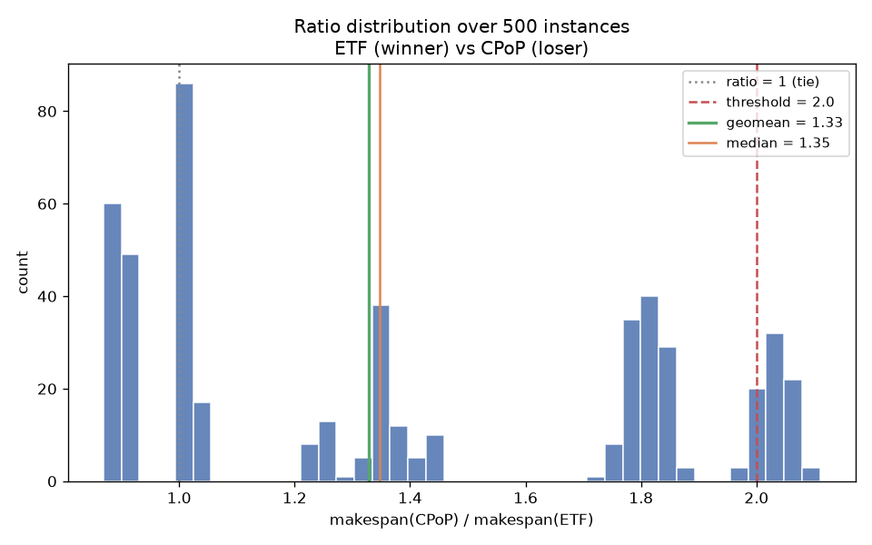
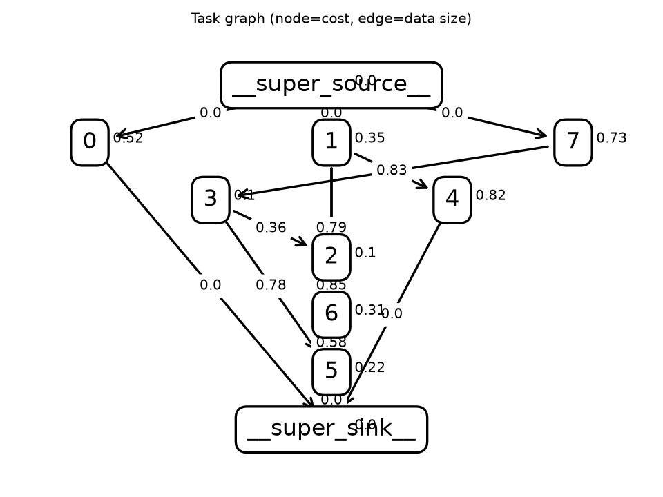
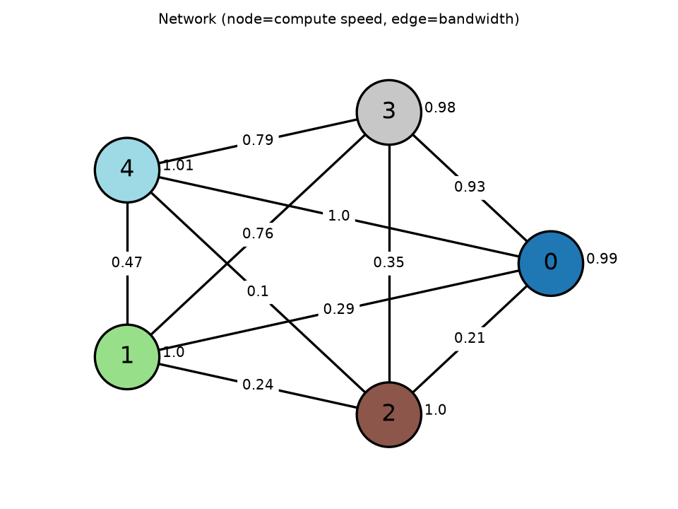
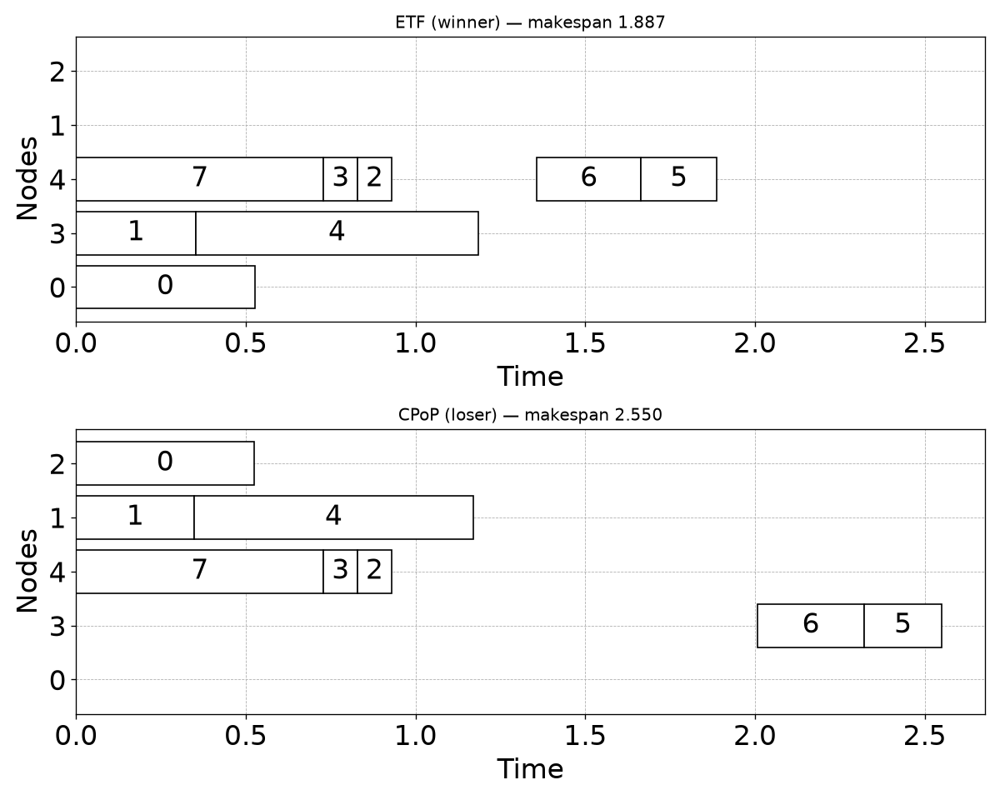

# Family report: ETF (winner) vs CPoP (loser)

Family source: `/tmp/claude-1000/-home-quinn-Documents-code-agentic-hypothesis/bf4a5d30-311d-477b-82d6-5ccbbc48c4f9/scratchpad/family_ETF_vs_CPoP_cost.py`

## Hypothesis

ETF requires homogeneous compute (all node speeds equal). Under that constraint, CPoP's critical-path-processor rule -- argmin(sum(critical task costs) / node.speed) -- becomes a flat tie across every node (all speeds equal), so Python's min() just returns whichever node happens to come first in Network.nodes's frozenset iteration order: effectively arbitrary, uncorrelated with the instance's real communication topology. So CPoP pins its critical path to a node chosen for no good reason -- sometimes that's fine, sometimes it's badly connected and hurts CPoP, while ETF (unpinned, but unable to insert into idle schedule gaps) is not affected by this specific failure mode. This gives a real but NOISY, largely uncontrollable lean toward ETF (observed geomean ~1.2-1.3 across sweeps) with p10 consistently BELOW 1.0 -- CPoP still wins a meaningful fraction of instances, because which node gets arbitrarily pinned is essentially a coin flip from the family generator's point of view.

## Makespan ratio  loser / winner

| metric | value |
|---|---|
| samples usable | 500 / 500 (0 errors) |
| geomean | 1.328 |
| mean | 1.396 |
| median | 1.347 |
| stdev | 0.437 |
| p10 / p90 | 0.893 / 2.024 |
| min / max | 0.869 / 2.110 |
| frac ≥ 2.0 | 14.2% |
| mean makespan winner / loser | 1.883 / 2.630 |
| **verdict** | **WEAK/INCONSISTENT** |

## Exemplar instance

Representative instance: winner makespan 1.887, loser makespan 2.550 (ratio 1.351).

## Claude API cost

Exact, read directly from the local Claude Code session transcript (`~/.claude/projects/.../*.jsonl`) for the turns spanning this investigation. Sonnet 5, current intro pricing (through 2026-08-31): $2.00/$10.00 per 1M input/output tokens, cache write (1h TTL) $4.00/1M, cache read $0.20/1M.

| | tokens | cost |
|---|---:|---:|
| input (uncached) | 136 | $0.00 |
| output | 81,761 | $0.82 |
| cache write (1h) | 106,533 | $0.43 |
| cache read | 18,134,153 | $3.63 |
| **total** | | **~$4.87** |
