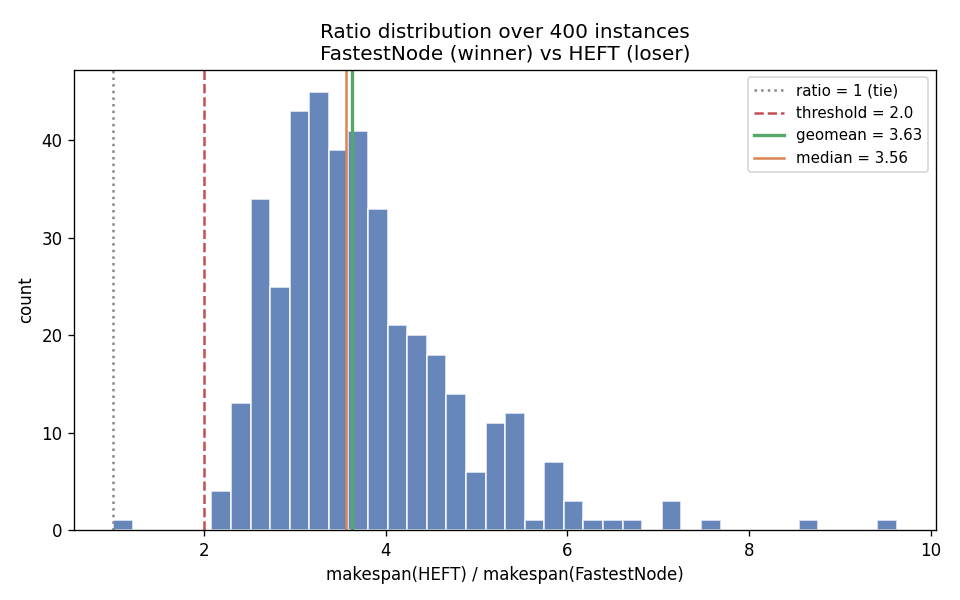
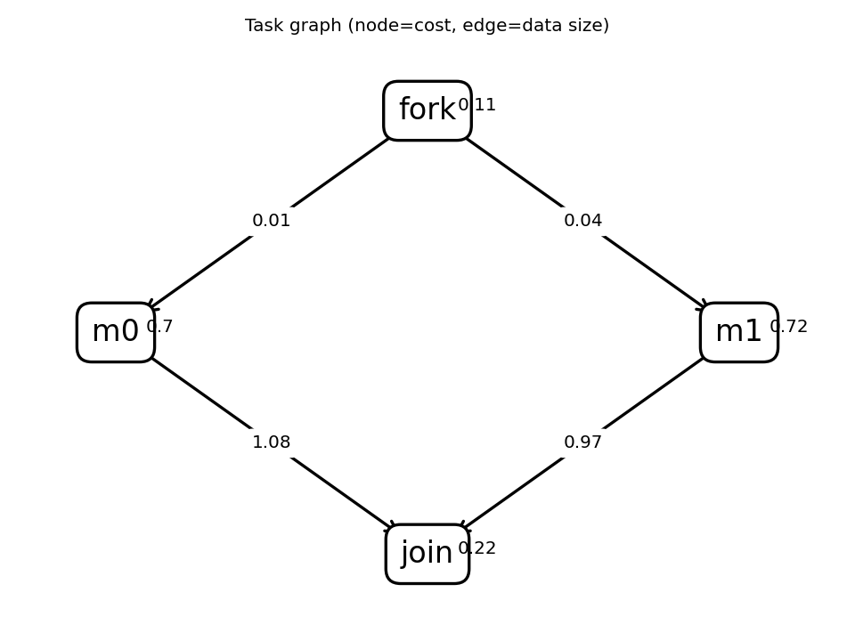
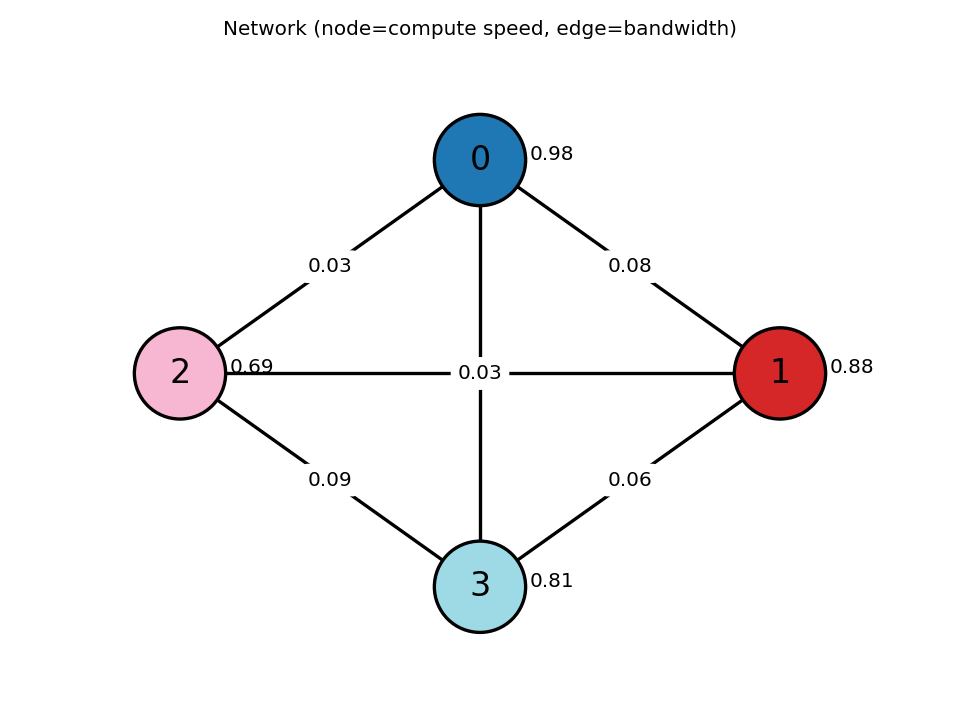
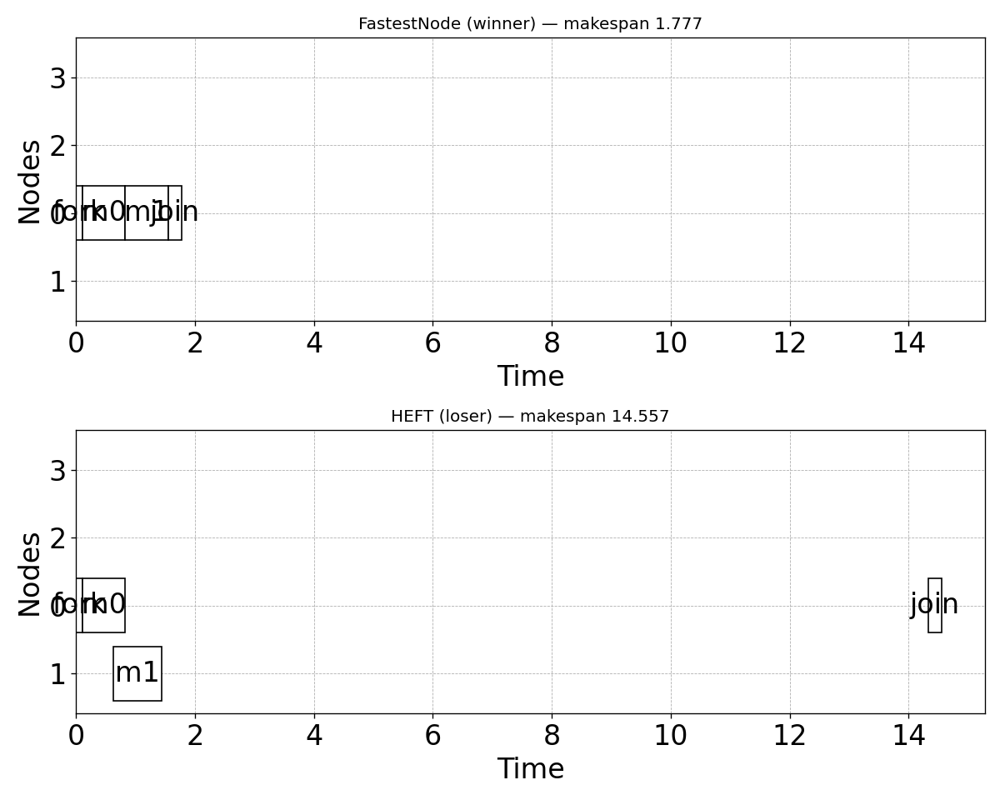

# Family report: FastestNode (winner) vs HEFT (loser)

Family source: `/tmp/claude-1000/-home-jared-projects-scheduling-agentic-hypothesis/1f5d9534-fa8e-47ed-8afd-c44097800803/scratchpad/family.py`

## Hypothesis

A fork-join DAG with heavy join data on a network of one fast node, a few only-slightly-slower nodes, and very slow links baits HEFT into offloading the parallel middle tasks onto slower nodes to shave each task's finish time. HEFT's greedy per-task rule ignores the future gather, so at the join it must ship every scattered result back over the slow links. FastestNode keeps everything on the fastest node, making all communication free, and wins because communication dominates once the tasks are scattered.

## Makespan ratio  loser / winner

| metric | value |
|---|---|
| samples usable | 400 / 400 (0 errors) |
| geomean | 3.627 |
| mean | 3.750 |
| median | 3.558 |
| p10 / p90 | 2.688 / 5.142 |
| min / max | 1.000 / 9.627 |
| frac ≥ 2.0 | 99.8% |
| mean makespan winner / loser | 2.450 / 9.055 |

## Exemplar instance

Representative instance: winner makespan 1.777, loser makespan 14.557 (ratio 8.192).

