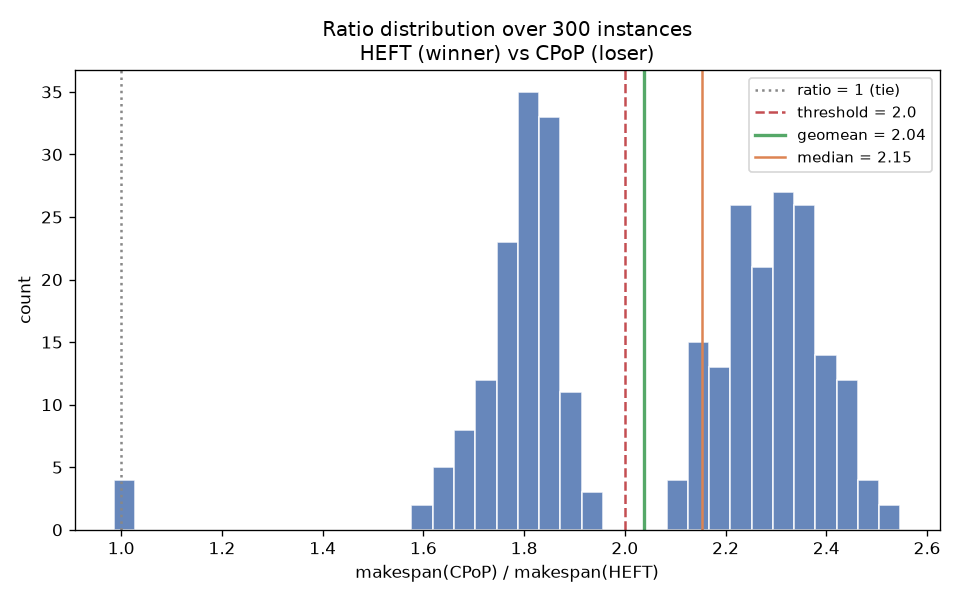
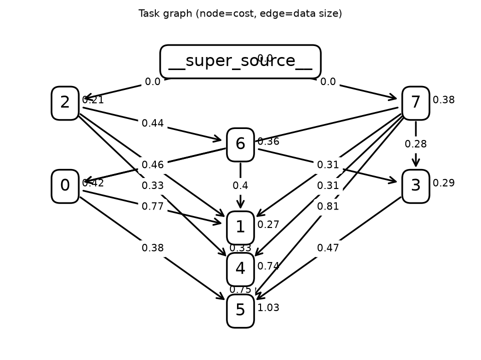
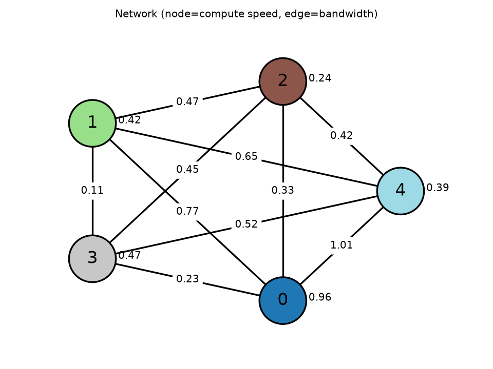
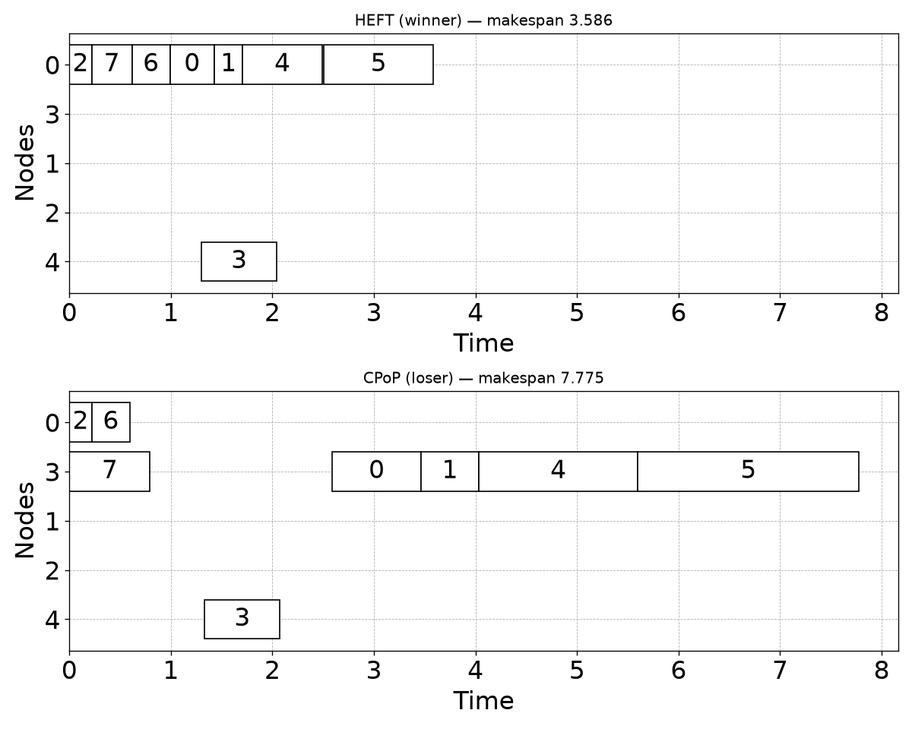

# Family report: HEFT (winner) vs CPoP (loser)

Family source: `outputs/HEFT_vs_CPoP/family.py`

## Hypothesis

CPoP ranks tasks by (upward rank + downward rank) and forces every task on the critical path onto a single fixed 'critical path processor' (the node minimizing total CP execution time), scheduling everything else around that commitment. In this DAG the critical path threads through several tasks that would be better placed on different nodes once contention is considered, so CPoP's single-processor commitment creates a serialization bottleneck. HEFT has no such constraint -- it picks the earliest-finish-time node independently for every task -- so it routes around the contention CPoP creates for itself. The effect depends on the exact rank tie-break / EFT comparisons in this instance (confirmed comparison-fragile by the perturbation sweep above), so the family stays close to the discovered seed rather than re-randomizing topology freely.

## Makespan ratio  loser / winner

| metric | value |
|---|---|
| samples usable | 300 / 300 (0 errors) |
| geomean | 2.037 |
| mean | 2.060 |
| median | 2.152 |
| stdev | 0.289 |
| p10 / p90 | 1.743 / 2.388 |
| min / max | 0.986 / 2.547 |
| frac ≥ 2.0 | 54.7% |
| mean makespan winner / loser | 3.491 / 7.183 |
| **verdict** | **STRONG** |

## Exemplar instance

Representative instance: winner makespan 3.586, loser makespan 7.775 (ratio 2.168).

## Notes / caveats

- **Comparison-fragile, not categorical.** `family_lib.sweep_perturbation` on the
  PISA seed showed the gap collapses to near-1.0 ratios once joint perturbation
  passes ~15-20% of each weight (p10 drops below 1.2 at frac=0.15, median starts
  hitting exact ties at frac=0.20). This family is deliberately a tight
  perturbation ball (±7%) around the seed's exact topology and weights, not a
  freely-restructured generator — see `family.py`'s docstring for the full sweep
  table.
- **CCR sweep not run.** `family_lib.estimate_ccr` averages over *all* network
  edges including the auto-added self-loops (intra-node bandwidth defaults to a
  very large finite value representing "free"), which drags the averaged edge
  speed up and the estimated CCR down to ~0 regardless of the real inter-node
  edge speeds. The benchmark script's CCR-sweep guard treats this as "zero
  communication" and skips it — an artifact of the estimator, not evidence that
  communication cost is irrelevant to the mechanism (dependency sizes in the
  family are firmly in the 0.2-0.9 range).
