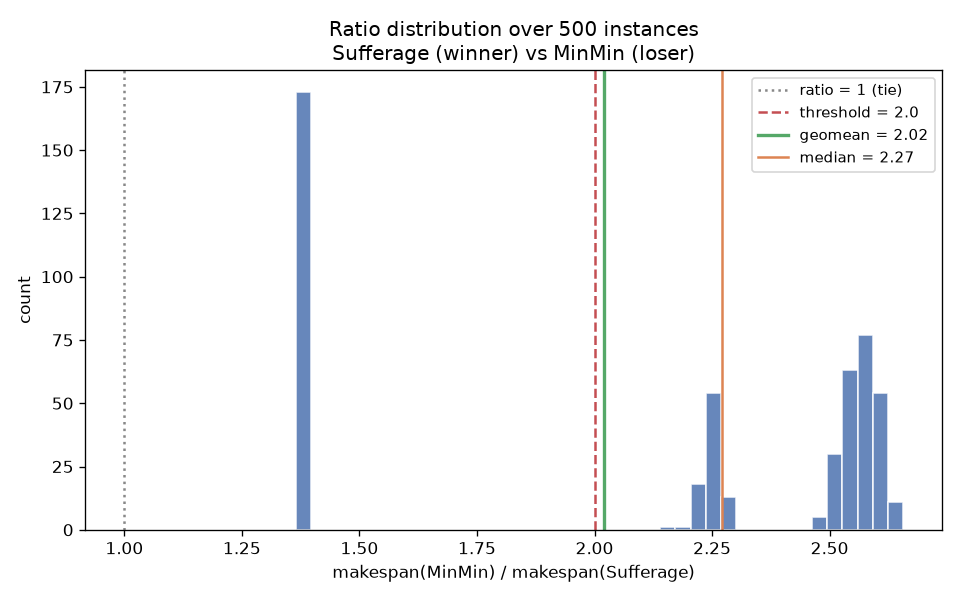
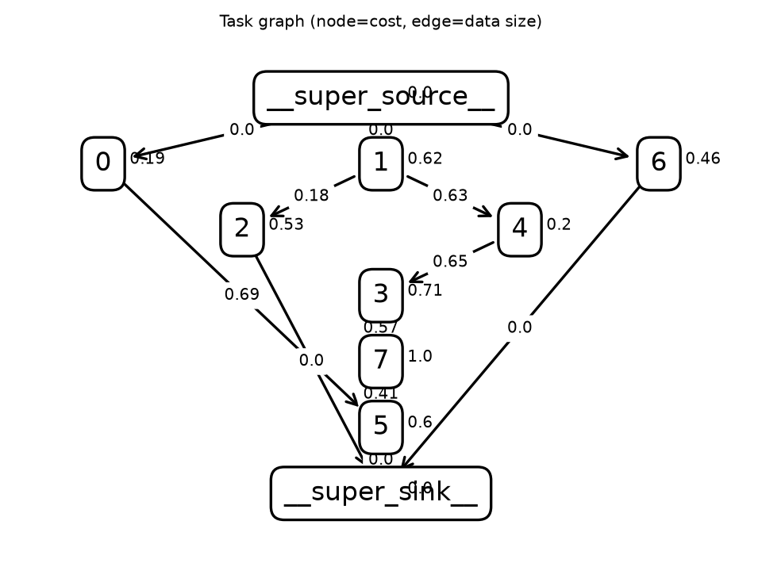
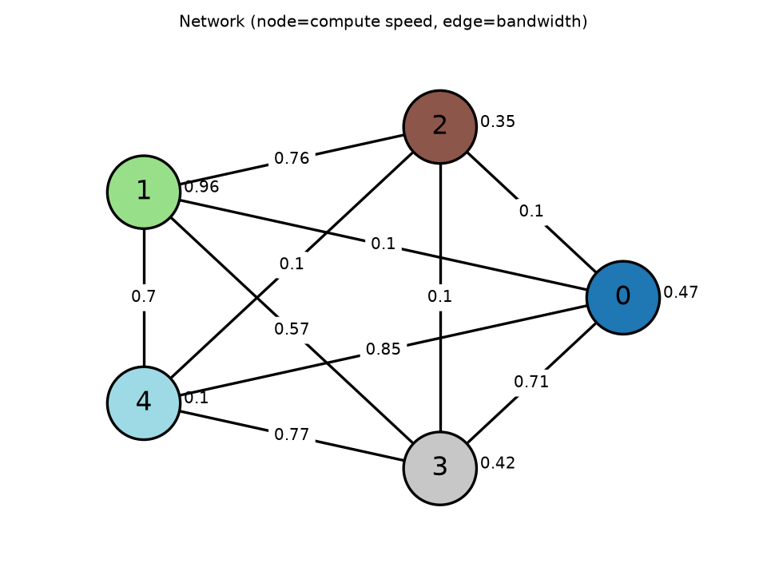
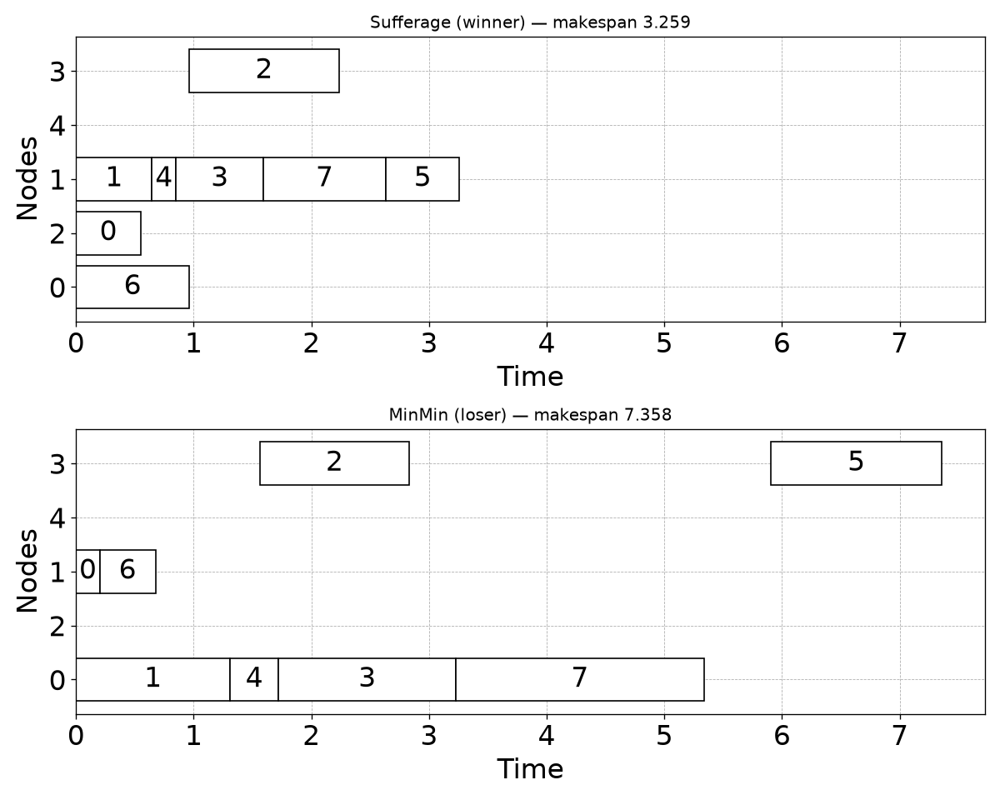

# Family report: Sufferage (winner) vs MinMin (loser)

Family source: `/tmp/claude-1000/-home-quinn-Documents-code-agentic-hypothesis/bf4a5d30-311d-477b-82d6-5ccbbc48c4f9/scratchpad/family_Sufferage_vs_MinMin_cost.py`

## Hypothesis

MinMin schedules, each round, whichever single (task, node) pair has the globally lowest estimated completion time, with no notion of urgency -- so a batch of flexible tasks (roughly equally happy on any node) can repeatedly grab a node that some OTHER task needs far more badly, just because their raw completion-time number happens to be lowest that round. Sufferage instead always schedules whichever available task has the largest gap between its best and second-best node (its 'sufferage') first, protecting exactly the tasks MinMin's rule can starve -- here, a sink task with a strong data-locality tie to one predecessor's node, competing against more flexible ready tasks that don't care much which node they land on.

## Makespan ratio  loser / winner

| metric | value |
|---|---|
| samples usable | 500 / 500 (0 errors) |
| geomean | 2.020 |
| mean | 2.098 |
| median | 2.270 |
| stdev | 0.541 |
| p10 / p90 | 1.370 / 2.600 |
| min / max | 1.365 / 2.656 |
| frac ≥ 2.0 | 65.4% |
| mean makespan winner / loser | 3.237 / 6.800 |
| **verdict** | **STRONG** |

## Exemplar instance

Representative instance: winner makespan 3.259, loser makespan 7.358 (ratio 2.257).

## Claude API cost

Exact, read directly from the local Claude Code session transcript (`~/.claude/projects/.../*.jsonl`) for the turns spanning this specific investigation (from the skill invocation through the next pair's invocation). Sonnet 5, current intro pricing (through 2026-08-31): $2.00/$10.00 per 1M input/output tokens, cache write (1h TTL) $4.00/1M, cache read $0.20/1M.

| | tokens | cost |
|---|---:|---:|
| input (uncached) | 62 | $0.00 |
| output | 33,679 | $0.34 |
| cache write (1h) | 67,703 | $0.27 |
| cache read | 7,220,987 | $1.44 |
| **total** | | **~$2.05** |
